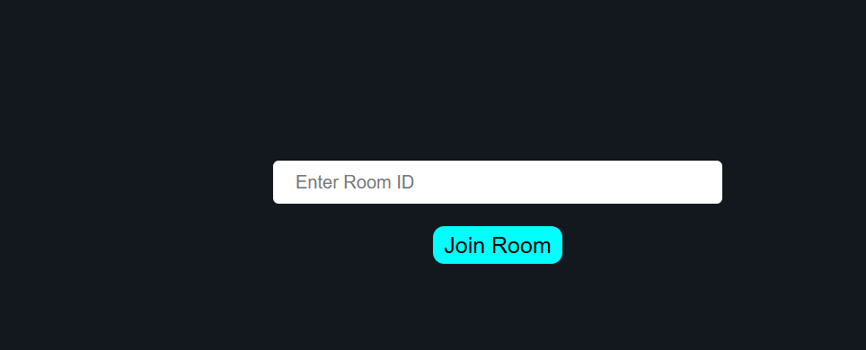
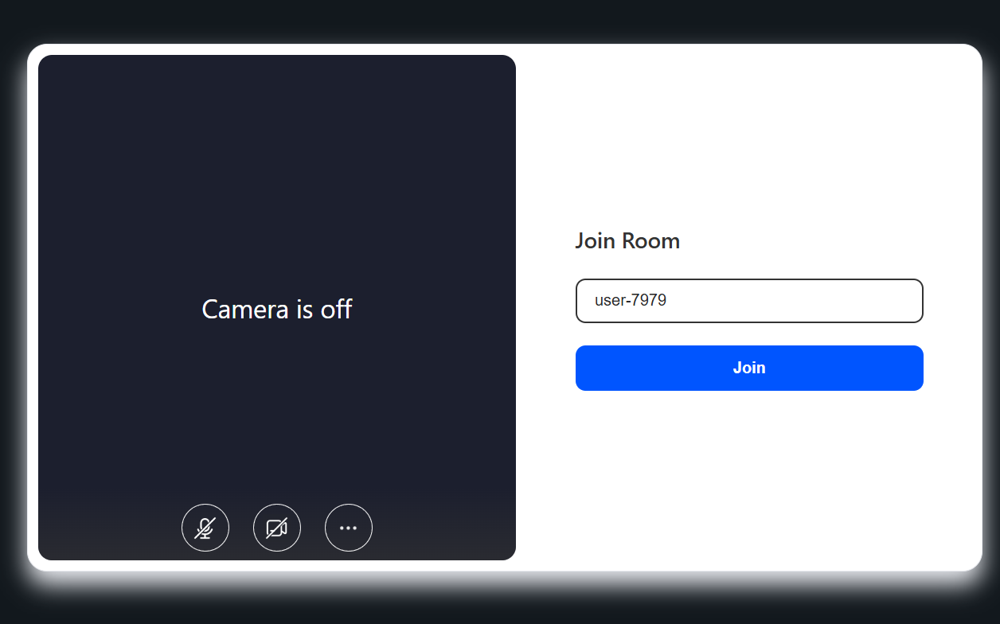

# Video Calling Website

A real-time video calling web application built using React and Vite. The application allows users to create and join meeting rooms through a simple and responsive interface using the ZEGOCLOUD Video Call SDK.

## Preview

### Home Page



### Video Meeting



---

## Features

- Real-time video calling
- Create and join meeting rooms
- Responsive user interface
- Dynamic room routing using React Router
- Fast development with Vite
- Clean and modern design

---

## Technologies Used

- React.js
- Vite
- JavaScript (ES6)
- HTML5
- CSS3
- React Router
- ZEGOCLOUD Video Call SDK

---

## Project Structure

```text
video-calling-website/
├── public/
├── screenshots/
├── src/
├── .gitignore
├── package.json
├── vite.config.js
└── README.md
```

---

## Getting Started

### Clone the repository

```bash
git clone https://github.com/Yuvraj-Dhakal/video-calling-website.git
```

### Navigate to the project folder

```bash
cd video-calling-website
```

### Install dependencies

```bash
npm install
```

### Start the development server

```bash
npm run dev
```

Open your browser and visit:

```
http://localhost:5173
```

---

## Security

For security reasons, project credentials have been removed from this public repository. To run the application, create your own ZEGOCLOUD project and configure it with your own credentials.

---

## Future Improvements

- Backend token generation
- User authentication
- Screen sharing
- In-meeting chat
- Meeting recording
- Meeting scheduling
- Improved UI/UX
- Production deployment

---

## License

This project is intended for educational and portfolio purposes.